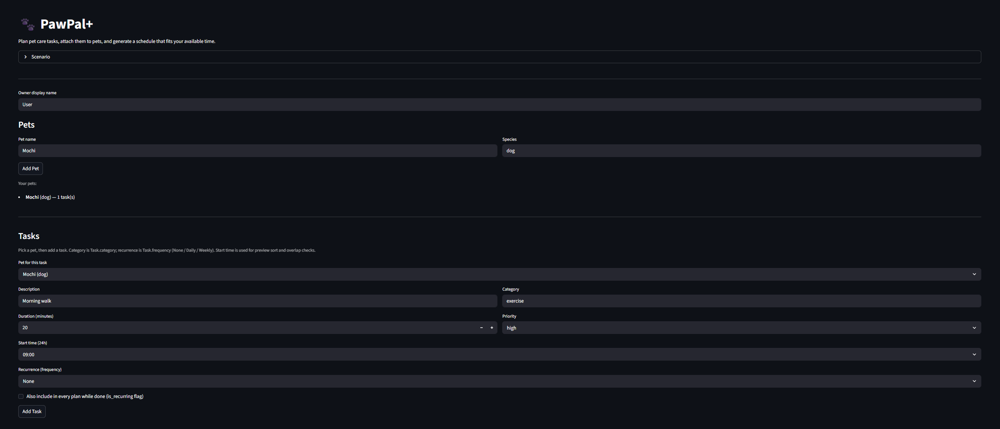

# PawPal+ (Module 2 Project)

You are building **PawPal+**, a Streamlit app that helps a pet owner plan care tasks for their pet.

## Scenario

A busy pet owner needs help staying consistent with pet care. They want an assistant that can:

- Track pet care tasks (walks, feeding, meds, enrichment, grooming, etc.)
- Consider constraints (time available, priority, owner preferences)
- Produce a daily plan and explain why it chose that plan

Your job is to design the system first (UML), then implement the logic in Python, then connect it to the Streamlit UI.

## What you will build

Your final app should:

- Let a user enter basic owner + pet info
- Let a user add/edit tasks (duration + priority at minimum)
- Generate a daily schedule/plan based on constraints and priorities
- Display the plan clearly (and ideally explain the reasoning)
- Include tests for the most important scheduling behaviors

## Key features

- **Chronological sorting** — The scheduler orders tasks with `Scheduler.sort_by_time()`, which sorts a list of `Task` instances by each task’s `start_time` string using a **`lambda`-based key** (`key=lambda t: t.start_time`). With consistent zero-padded `HH:MM` values, that lexicographic order matches true time-of-day order, so the Streamlit **Preview** table and any downstream logic see your day from morning through evening.

- **Smart conflict detection** — `Scheduler.check_for_conflicts()` turns each task into a **half-open interval** `[start, end)` on its `due_date` by combining the calendar date with `start_time` and adding `duration_mins` via **`timedelta`**. It compares every pair of tasks: if the latest start is still before the earliest end, those windows overlap and a **human-readable warning** is returned. For pet owners, that surfaces **double-booked slots** (for example, two chores both claiming your 9:00 hour) before you rely on a plan that assumes you can be in two places at once.

- **Automated recurrence** — When a task is marked complete, `Task.mark_complete()` sets `is_completed` and, for **Daily** or **Weekly** frequencies, builds the next `Task` with the same metadata and a new `due_date` computed as the original date plus **`timedelta(days=1)`** or **`timedelta(days=7)`**. `Pet.complete_task()` (and `Scheduler.handle_recurrence()`, which delegates to it) **appends** that next occurrence to the pet’s list. Owners keep **standing routines** (meds, walks, litter, grooming) on the calendar without re-entering them every day.

### App preview

Demo screenshots live under **`images/`** using names such as **`preview.png`** (add your captures there so they render in GitHub and local viewers).



## Getting started

### Setup

```bash
python -m venv .venv
source .venv/bin/activate  # Windows: .venv\Scripts\activate
pip install -r requirements.txt
```

### Suggested workflow

1. Read the scenario carefully and identify requirements and edge cases.
2. Draft a UML diagram (classes, attributes, methods, relationships).
3. Convert UML into Python class stubs (no logic yet).
4. Implement scheduling logic in small increments.
5. Add tests to verify key behaviors.
6. Connect your logic to the Streamlit UI in `app.py`.
7. Refine UML so it matches what you actually built.

## Testing PawPal+

### How to run

Run the full test suite from the project root:

```bash
python -m pytest
```

### Coverage summary

The unit tests in `tests/test_pawpal.py` exercise core behavior of `pawpal_system.py`, including:

- **Sorting integrity** — Tasks are ordered in correct chronological order when sorted by `start_time`.
- **Recurrence logic** — Completing a daily (or weekly) task creates the next occurrence with the expected `due_date` advance via `timedelta`.
- **Collision detection** — The scheduler reports when task time windows overlap, so overlapping blocks are not silently ignored.

### Reliability score

**System confidence level:** 5/5 stars

Because the core scheduling logic lives in `pawpal_system.py`, separate from the Streamlit UI, it can be fully unit-tested. That separation keeps the scheduling “brain” predictable under bad or unusual input and helps catch edge cases before they reach the interface.
